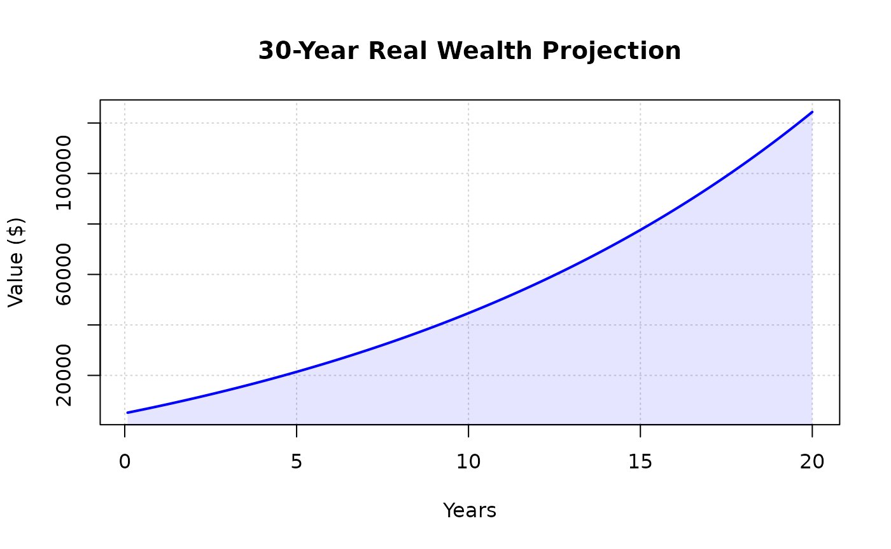

# Adjusting for Inflation

``` r

library(wealthR)
```

## Description

Adjusts a sequence of nominal financial values for inflation to reflect
their real value in today’s purchasing power. This function uses a
monthly discount factor based on the provided annual inflation rate.

## Usage

adjust_inflation(amounts, inflation_rate)

## Arguments

- `amounts`: Numeric vector. The nominal future values (typically the
  output from calc_wealth
- `inflation_rate`: Numeric. The annual inflation rate (as a decimal,
  e.g., 0.03 for 3%).

## Value

A numeric vector of the same length as amounts, containing values
adjusted for the cumulative effect of inflation.

## Example

``` r

# Define 'viz_data' to avoid conflict with the data() function
viz_data <- wealthR::calc_wealth(5000, 200, 0.07, 20)

plot_wealth(viz_data, title = "30-Year Real Wealth Projection")
```


