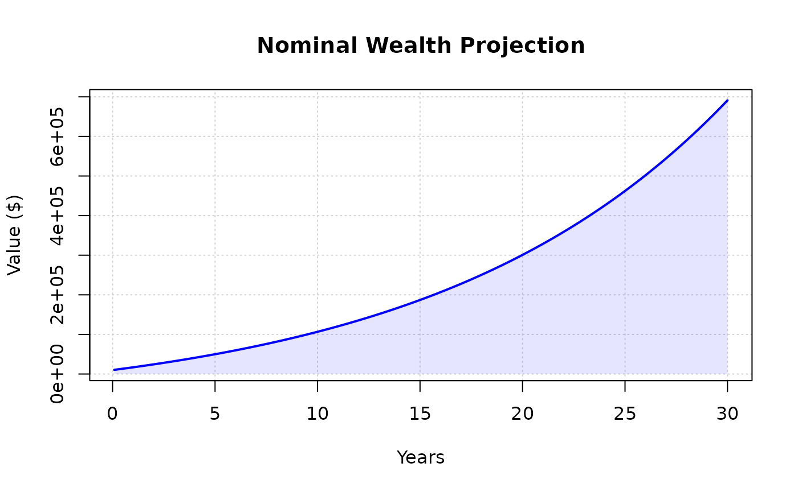

# introduction to wealthR

## Overview

`wealthR` is a lightweight, zero-dependency R package for simple
financial forecasting.  
It is designed to help users model investment growth, savings plans,
inflation effects, and loan repayment using base R only.

The package focuses on small, practical functions that are easy to read,
easy to test, and useful in real-world planning.

## What this package does

The package includes tools to:

- simulate long-term investment growth.
- adjust future values for inflation.
- project savings over time.
- forecast loan balances.
- compare multiple scenarios.
- create base R visualizations.

## Getting started

``` r
library(wealthR)
```

Then you can run functions such as:

``` r
# Calculate growth over 30 years
raw_wealth <- calc_wealth(principal = 10000, monthly = 500, rate = 0.07, years = 30)
head(raw_wealth,20)
#>  [1] 10558.33 11119.92 11684.79 12252.95 12824.43 13399.24 13977.40 14558.93
#>  [9] 15143.86 15732.20 16323.97 16919.19 17517.89 18120.08 18725.78 19335.01
#> [17] 19947.80 20564.16 21184.12 21807.69
```

``` r
# Adjust the projection for 3% annual inflation
real_wealth <-adjust_inflation(amounts = raw_wealth, inflation_rate = 0.03, years = 30)
head(real_wealth,20)
#>  [1] 10532.00 11064.53 11597.59 12131.18 12665.32 13199.99 13735.22 14271.00
#>  [9] 14807.34 15344.25 15881.72 16419.77 16958.40 17497.61 18037.41 18577.80
#> [17] 19118.79 19660.39 20202.59 20745.41
```

``` r
# Compare the nominal vs. inflation-adjusted wealth
plot_wealth(raw_wealth, title = "Nominal Wealth Projection")
```



``` r
plot_wealth(real_wealth, title = "Inflation-Adjusted Wealth")
```


