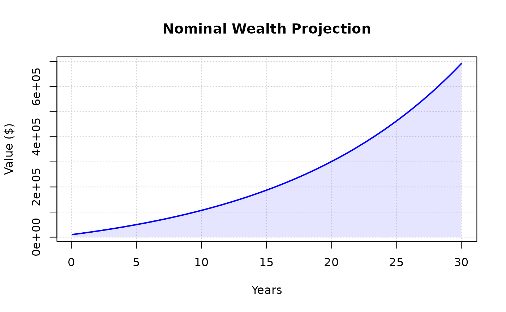
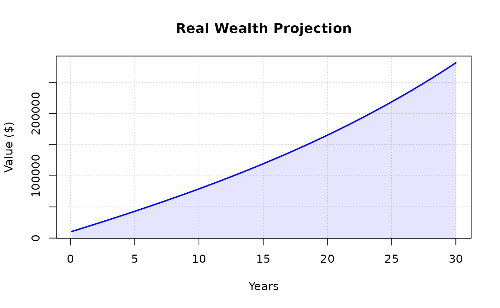

# Introduction

## Overview

`wealthR` is a lightweight, zero-dependency R package for simple
financial forecasting.

It is designed to help users model investment growth, savings plans, and
inflation effects using base R logic.

The package focuses on small, practical functions that are easy to read,
easy to test, and useful for long-term financial planning.

## What this package does

The package includes tools to:

- Simulate Investment Growth: Model principal and monthly contributions
  with compounding interest (Ordinary Annuity).
- Adjust for Inflation: Convert future nominal values into real
  purchasing-power terms.
- Robust Calculations: Safely handle edge cases, such as 0 parcent
  interest rates or inflation.
- Base R Visualizations: Generate clean, professional wealth trajectory
  plots without external dependencies.

## Getting started

To begin using the package, load it into your environment:

### Calculate Nominal Growth

You can project the future value of an initial investment plus monthly
contributions. The calc_wealth function calculates the balance for every
month in the period.

``` r

# Calculate growth over 30 years
raw_wealth <- calc_wealth(
  principal = 10000,
  monthly = 500,
  rate = 0.07,
  years = 30
)
head(raw_wealth, 12)
#>  [1] 10558.33 11119.92 11684.79 12252.95 12824.43 13399.24 13977.40 14558.93
#>  [9] 15143.86 15732.20 16323.97 16919.19
```

### Adjust for Inflation

To see what that money will actually buy in the future, use
adjust_inflation. This function now automatically detects the time
horizon based on the length of your wealth vector.

``` r

# Adjust the projection for 3% annual inflation
real_wealth <- adjust_inflation(
  amounts = raw_wealth,
  inflation_rate = 0.03
)
head(real_wealth, 20)
#>  [1] 10532.00 11064.53 11597.59 12131.18 12665.32 13199.99 13735.22 14271.00
#>  [9] 14807.34 15344.25 15881.72 16419.77 16958.40 17497.61 18037.41 18577.80
#> [17] 19118.79 19660.39 20202.59 20745.41
```

### Visualizing the Trajectory

The plot_wealth function provides a quick way to see the growth curve
with a shaded area representing total accumulation.

``` r

# Compare the nominal vs. inflation-adjusted wealth
plot_wealth(raw_wealth, title = "Nominal Wealth Projection")
```



``` r

plot_wealth(real_wealth, title = "Real Wealth Projection")
```


