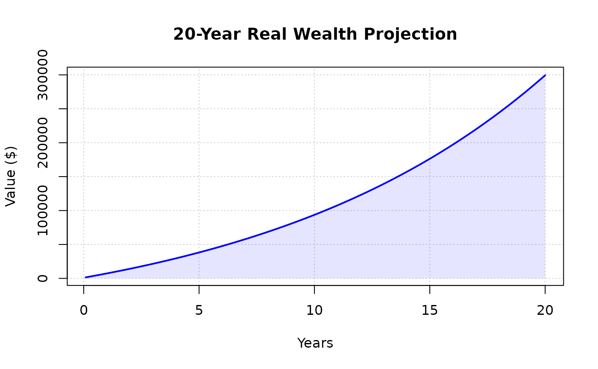

# Plotting Wealth

``` r

library(wealthR)
```

## Description

Generates a visual representation of wealth growth over time. It creates
a blue line plot with a light blue shaded area underneath to clearly
illustrate the accumulation of assets.

## Usage

plot_wealth(data, title)

## Arguments

- `data`: Numeric vector. The values to be plotted, assumed to be at
  monthly intervals.
- `title`: String. The title displayed at the top of the plot. Defaults
  to `"Wealth Projection"`.

## Value

Displays a plot in the active graphics device and invisibly returns
`NULL`

## Example

``` r

my_saving <- calc_wealth(1000, 500, 0.08, 20)
# Visualize the inflation-adjusted wealth
plot_wealth(my_saving, title = "20-Year Real Wealth Projection")
```


